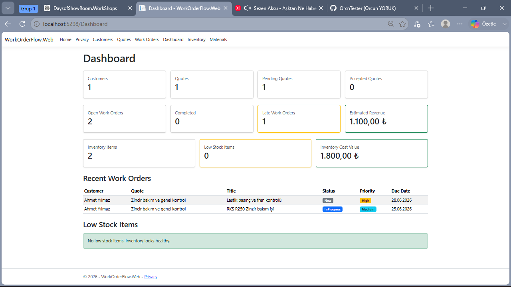
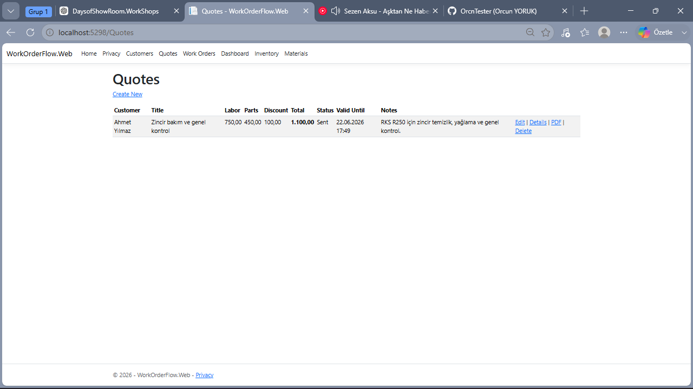
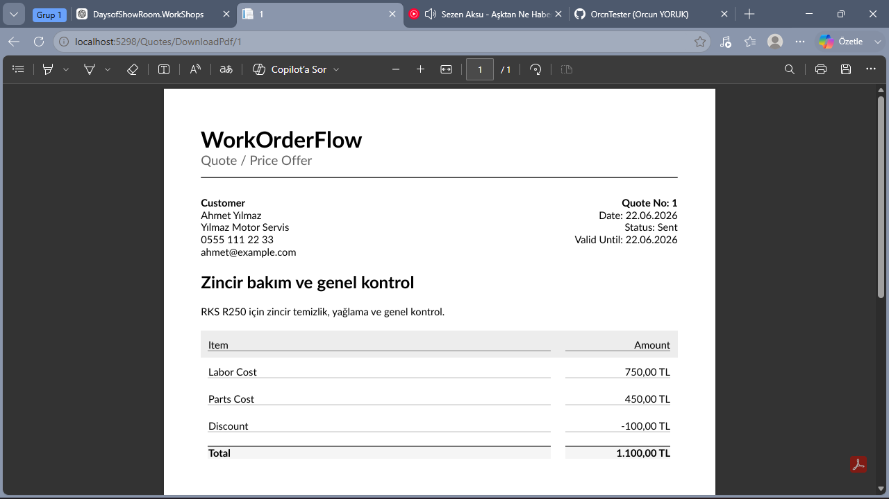
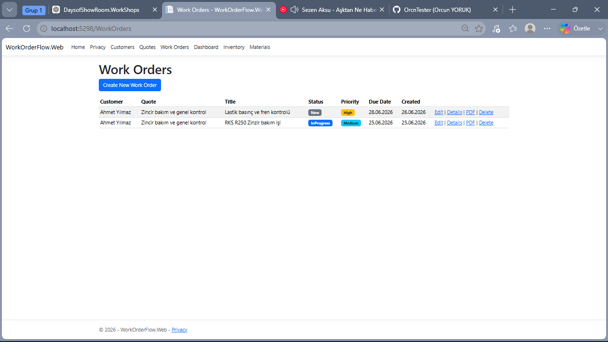
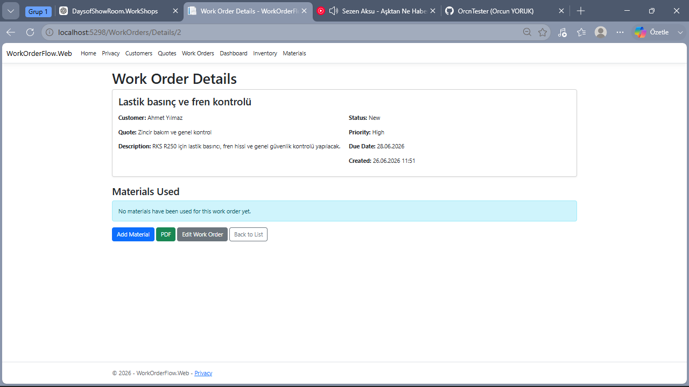
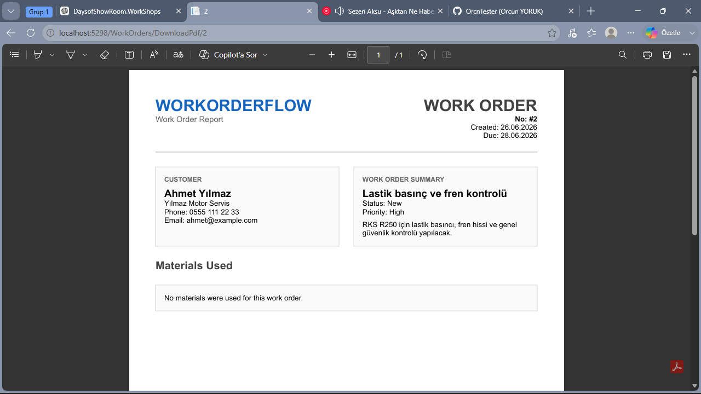
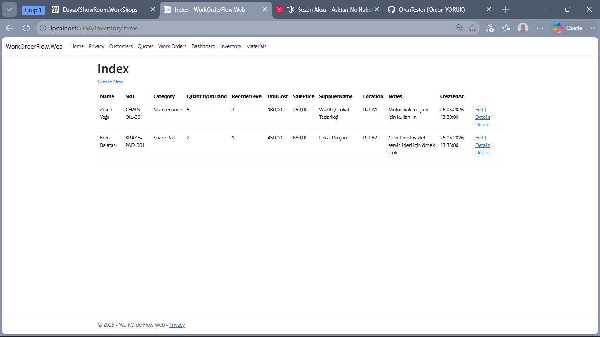
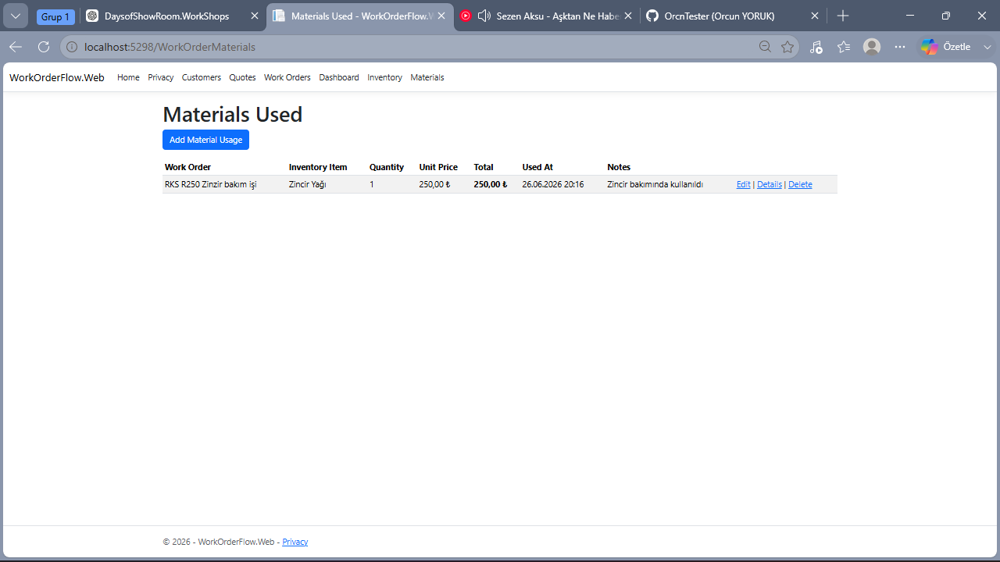

# WorkOrderFlow

WorkOrderFlow is an ASP.NET Core MVC operations management application designed for small businesses and service teams that need to manage customers, quotes, work orders, inventory, material usage, dashboard metrics, and PDF exports from a single workflow.

The project focuses on a real business process:

```text
Customer → Quote → Work Order → Materials Used → Inventory Update → PDF Output → Dashboard
```

---

## Overview

WorkOrderFlow is built as a portfolio-grade business application. It demonstrates how a real-world operations system can track customers, create quotes, convert operational work into work orders, consume inventory items through material usage records, and generate PDF documents for both quotes and work orders.

The main goal of the project is not only to provide CRUD screens, but to model an actual business workflow with domain logic.

---

## Features

### Customer Management

* Create, edit, view, and delete customers
* Store customer contact information
* Link customers to quotes and work orders

### Quote Management

* Create quotes for customers
* Track labor cost, parts cost, discount, status, and validity date
* Display calculated quote total
* Show customer names instead of raw IDs
* Export quotes as PDF documents

### Work Order Management

* Create work orders connected to customers and optional quotes
* Track status, priority, due date, completion date, and resolution notes
* Display work order status and priority with visual badges
* View materials used inside the work order details page
* Export work orders as PDF reports

### Inventory Management

* Manage inventory items
* Track SKU, category, quantity on hand, reorder level, unit cost, sale price, supplier, and location
* Identify low-stock items
* Display inventory metrics on the dashboard

### Work Order Materials

* Add inventory items used on a work order
* Calculate line totals based on quantity and unit price
* Automatically decrease inventory quantity when material is used
* Automatically restore inventory quantity when material usage is deleted
* Display used materials with work order and inventory item names

### Dashboard

* Total customers
* Total quotes
* Pending quotes
* Accepted quotes
* Open work orders
* Completed work orders
* Late work orders
* Estimated revenue
* Inventory item count
* Low stock item count
* Inventory cost value
* Recent work orders
* Low stock items

### PDF Export

* Quote PDF export
* Work Order PDF export
* PDF generation with QuestPDF
* Customer details, quote/work order summary, cost breakdown, and material usage summaries

---

## Tech Stack

* ASP.NET Core MVC
* C#
* Entity Framework Core
* SQLite
* Razor Views
* Bootstrap
* QuestPDF
* Git / GitHub

---

## Domain Workflow

The core workflow of the application is:

```text
1. A customer is created.
2. A quote is prepared for the customer.
3. The quote can be exported as a PDF.
4. A work order is created from the customer and optional quote.
5. Materials used in the work order are recorded.
6. Inventory stock is automatically reduced.
7. Work order details show the used materials and material totals.
8. The work order can be exported as a PDF.
9. Dashboard metrics reflect operational activity.
```

This workflow demonstrates customer management, quoting, job tracking, stock movement, reporting, and document generation.

---

## Project Structure

```text
WorkOrderFlow
│
├── WorkOrderFlow.Web
│   ├── Controllers
│   │   ├── CustomersController.cs
│   │   ├── QuotesController.cs
│   │   ├── WorkOrdersController.cs
│   │   ├── InventoryItemsController.cs
│   │   ├── WorkOrderMaterialsController.cs
│   │   └── DashboardController.cs
│   │
│   ├── Data
│   │   └── ApplicationDbContext.cs
│   │
│   ├── Models
│   │   ├── Customer.cs
│   │   ├── Quote.cs
│   │   ├── WorkOrder.cs
│   │   ├── InventoryItem.cs
│   │   └── WorkOrderMaterial.cs
│   │
│   ├── Services
│   │   ├── QuotePdfService.cs
│   │   └── WorkOrderPdfService.cs
│   │
│   ├── ViewModels
│   │   └── DashboardViewModel.cs
│   │
│   ├── Views
│   │   ├── Customers
│   │   ├── Quotes
│   │   ├── WorkOrders
│   │   ├── InventoryItems
│   │   ├── WorkOrderMaterials
│   │   ├── Dashboard
│   │   └── Shared
│   │
│   └── Program.cs
│
└── README.md
```

---

## Main Entities

### Customer

Represents a person or business that receives quotes and work orders.

### Quote

Represents a price offer connected to a customer. It includes labor cost, parts cost, discount, total amount, status, and validity date.

### WorkOrder

Represents the actual operational job. It includes status, priority, due date, completion date, and resolution notes.

### InventoryItem

Represents a stock item that can be used in work orders. It tracks available quantity, reorder level, cost, and sale price.

### WorkOrderMaterial

Represents a material used in a work order. It connects work orders to inventory items and updates inventory quantity through business logic.

---

## Business Logic

The most important domain rule in the project is inventory stock movement.

When a material is added to a work order:

```text
InventoryItem.QuantityOnHand -= WorkOrderMaterial.QuantityUsed
```

When a material usage record is deleted:

```text
InventoryItem.QuantityOnHand += WorkOrderMaterial.QuantityUsed
```

This moves the project beyond basic CRUD and demonstrates real operational behavior.

---

## PDF Generation

PDF export is implemented with QuestPDF.

The application currently supports:

* Quote PDF export
* Work Order PDF export

PDF files include customer information, quote or work order details, pricing data, material usage, and generated timestamps.

---

## Getting Started

### Requirements

* .NET SDK
* Visual Studio Code or Visual Studio
* SQLite-compatible EF Core setup

### Clone the repository

```bash
git clone <repository-url>
cd WorkOrderFlow
```

### Restore packages

```bash
dotnet restore
```

### Apply database migrations

```bash
cd WorkOrderFlow.Web
dotnet ef database update
```

### Run the application

```bash
dotnet run
```

Open the application in your browser:

```text
http://localhost:5298
```

---

## Useful URLs

```text
/Customers
/Quotes
/WorkOrders
/InventoryItems
/WorkOrderMaterials
/Dashboard
```

PDF examples:

```text
/Quotes/DownloadPdf/1
/WorkOrders/DownloadPdf/1
```

---

## Screenshots

### Dashboard



### Quotes



### Quote PDF Export



### Work Orders



### Work Order Details



### Work Order PDF Export



### Inventory



### Materials Used



---

## Roadmap

Possible next improvements:

* Authentication and role-based access
* Better form validation
* Search and filtering on list pages
* Quote-to-work-order conversion button
* Inventory transaction history
* Work order status timeline
* Dashboard charts
* Better UI layout and responsive polish
* PostgreSQL support
* Docker support
* Deployment pipeline

---

## Portfolio Summary

WorkOrderFlow is a full-stack ASP.NET Core MVC business application that demonstrates:

* Domain modeling
* Entity Framework Core relationships
* SQLite persistence
* MVC controllers and Razor views
* Dashboard reporting
* Inventory stock logic
* PDF generation
* Real business workflow implementation

It is designed as a practical operations management system for small businesses and service teams.
