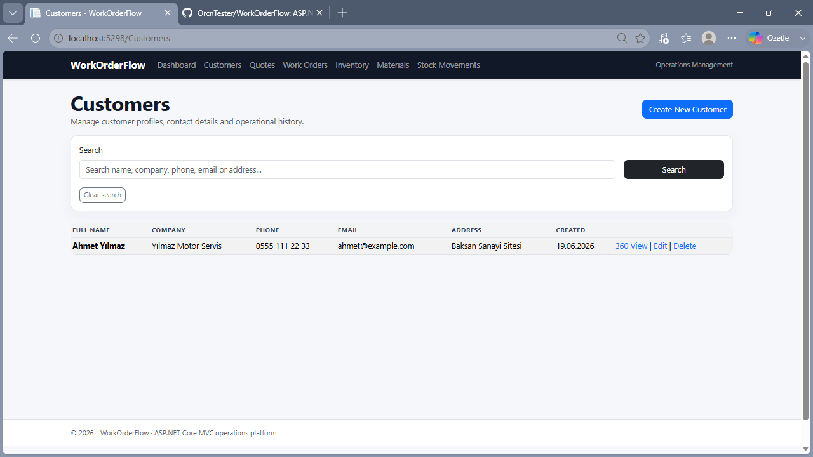
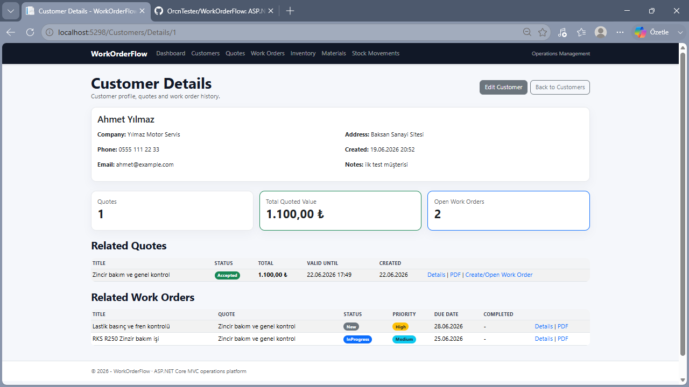
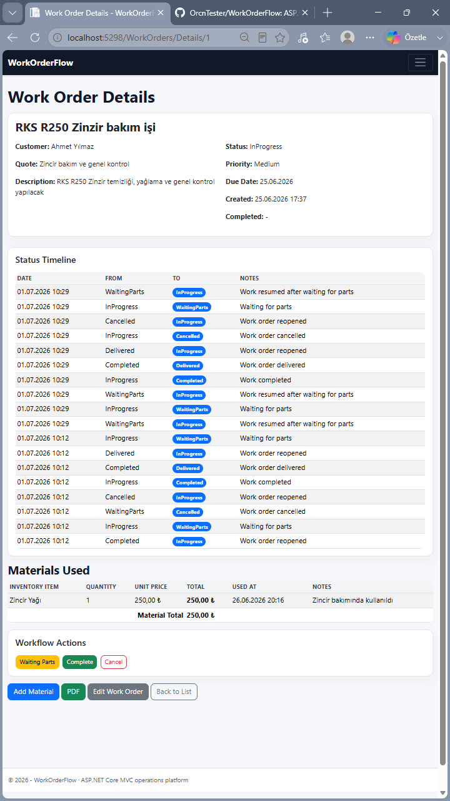
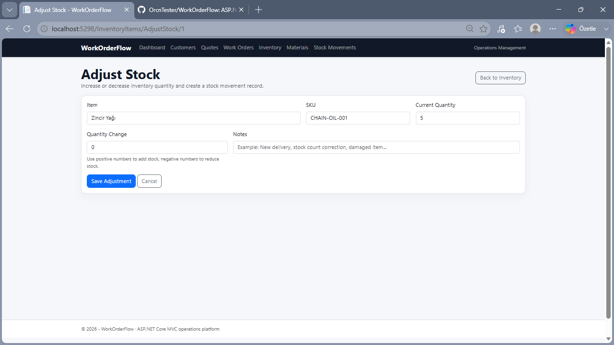
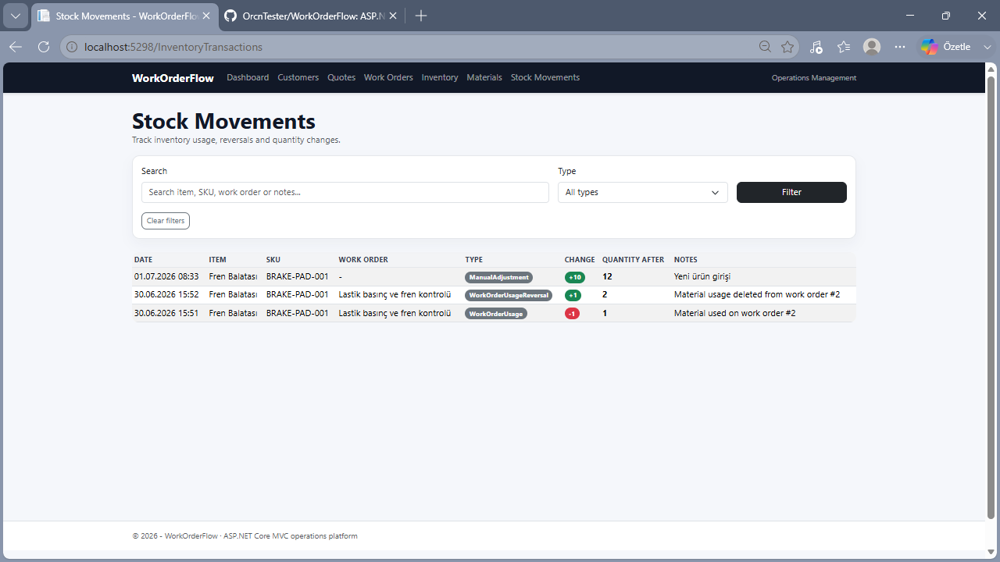

# WorkOrderFlow


WorkOrderFlow is an ASP.NET Core MVC operations management application designed for small businesses and service teams that need to manage customers, quotes, work orders, inventory, stock movements, material usage, workflow status history, dashboard metrics, and PDF exports from a single operational workflow.

The project focuses on a realistic business process:

```text
Customer → Quote → Quote PDF → Work Order → Workflow Actions → Materials Used → Inventory Update → Stock Movement History → Work Order PDF → Dashboard
```

---

## Overview

WorkOrderFlow is built as a portfolio-grade business application. It demonstrates how a real-world operations system can track customers, prepare quotes, convert accepted quotes into work orders, manage work order status transitions, consume inventory through material usage, record stock movement history, and generate PDF documents.

The main goal of the project is not only to provide CRUD screens, but to model an actual business workflow with domain logic, reporting, audit-style history, and operational summaries.

---

## Features

### Customer Management

- Create, edit, view, and delete customers
- Search customers by name, company, phone, email, or address
- Customer 360 detail page
- View related quotes for a customer
- View related work orders for a customer
- Display customer-level quoted value and open work order count

### Quote Management

- Create and manage customer quotes
- Track labor cost, parts cost, discount, total amount, status, and validity date
- Search quotes by customer, title, or notes
- Filter quotes by status
- Export quotes as PDF documents
- Convert a quote into a work order
- Prevent duplicate work orders from the same quote
- Automatically mark quote as accepted when converted into a work order

### Work Order Management

- Create and manage operational work orders
- Link work orders to customers and optional quotes
- Track status, priority, due date, completion date, and resolution notes
- Search work orders by customer, title, or description
- Filter work orders by status and priority
- Start work, mark waiting for parts, complete, deliver, reopen, or cancel directly from the work order details page
- Automatically set completed date when a work order is completed
- Display workflow buttons based on the current status
- Track work order status changes with a timeline
- Export work orders as PDF documents

### Work Order Materials

- Add inventory items used on a work order
- Calculate material line totals
- Display materials used on the work order details page
- Automatically decrease inventory stock when materials are used
- Automatically restore inventory stock when material usage is deleted
- Record stock movement history for work order material usage and reversals

### Inventory Management

- Create, edit, view, and delete inventory items
- Search inventory by item name, SKU, category, supplier, or location
- Filter low-stock items
- Track quantity on hand, reorder level, unit cost, sale price, supplier, and storage location
- Display low-stock status badges
- Adjust stock manually with positive or negative quantity changes
- Prevent manual stock adjustments from reducing stock below zero
- Record manual stock adjustments in stock movement history
- Record initial stock quantity when an inventory item is created

### Stock Movement History

- Track all inventory movements in one place
- Record work order material usage
- Record work order material deletion reversals
- Record manual stock adjustments
- Search stock movements by item, SKU, work order, or notes
- Filter stock movements by transaction type
- Display quantity change and quantity after movement

### Dashboard

- Customer, quote, and work order metrics
- Inventory health metrics
- Material usage metrics
- Stock movement summary
- Recent work orders
- Recent stock movements
- Low-stock item list
- Work orders by status chart
- Quotes by status chart
- Inventory health chart

### PDF Export

- Quote PDF export
- Work Order PDF export
- PDF generation with QuestPDF
- Customer, quote, work order, pricing, material, status, and timestamp details included in generated documents

---

## Tech Stack

- ASP.NET Core MVC
- C#
- Entity Framework Core
- SQLite
- Razor Views
- Bootstrap
- QuestPDF
- Chart.js
- Git / GitHub
- xUnit
- GitHub Actions

---

## Business Workflow

WorkOrderFlow models a realistic small business operations flow:

```text
Customer
   ↓
Quote
   ↓
Quote PDF
   ↓
Create Work Order from Quote
   ↓
Start Work
   ↓
Add Materials Used
   ↓
Inventory Stock Decreases
   ↓
Stock Movement Is Recorded
   ↓
Complete Work
   ↓
Deliver Work Order
   ↓
Work Order PDF
   ↓
Dashboard Reporting
```

The application is not just a CRUD demo. It includes operational rules such as quote-to-work-order conversion, inventory stock deduction, stock movement history, manual stock adjustments, work order status transitions, completed date handling, work order timeline tracking, and customer-level operational summaries.

---

## Project Structure

```text
WorkOrderFlow
│
├── WorkOrderFlow.Web
│   ├── Controllers
│   │   ├── CustomersController.cs
│   │   ├── QuotesController.cs
│   │   ├── WorkOrdersController.cs
│   │   ├── InventoryItemsController.cs
│   │   ├── InventoryTransactionsController.cs
│   │   ├── WorkOrderMaterialsController.cs
│   │   └── DashboardController.cs
│   │
│   ├── Data
│   │   └── ApplicationDbContext.cs
│   │
│   ├── Models
│   │   ├── Customer.cs
│   │   ├── Quote.cs
│   │   ├── WorkOrder.cs
│   │   ├── WorkOrderStatusHistory.cs
│   │   ├── InventoryItem.cs
│   │   ├── InventoryTransaction.cs
│   │   └── WorkOrderMaterial.cs
│   │
│   ├── Services
│   │   ├── QuotePdfService.cs
│   │   ├── WorkOrderPdfService.cs
│   │   ├── WorkOrderWorkflowService.cs
│   │   ├── InventoryStockService.cs
│   │   └── QuoteToWorkOrderService.cs
│   │
│   ├── ViewModels
│   │   ├── DashboardViewModel.cs
│   │   └── StockAdjustmentViewModel.cs
│   │
│   ├── Views
│   │   ├── Customers
│   │   ├── Quotes
│   │   ├── WorkOrders
│   │   ├── InventoryItems
│   │   ├── InventoryTransactions
│   │   ├── WorkOrderMaterials
│   │   ├── Dashboard
│   │   └── Shared
│   │
│   └── Program.cs
│
├── WorkOrderFlow.Tests
│   ├── InventoryStockServiceTests.cs
│   ├── WorkOrderWorkflowServiceTests.cs
│   └── QuoteToWorkOrderServiceTests.cs
│
├── screenshots
│
└── README.md
```

---

## Main Entities

### Customer

Represents a person or business that receives quotes and work orders.

### Quote

Represents a price offer connected to a customer. It includes labor cost, parts cost, discount, total amount, status, validity date, and quote-to-work-order conversion behavior.

### WorkOrder

Represents the actual operational job. It includes status, priority, due date, completion date, resolution notes, customer relationship, optional quote relationship, materials used, and PDF output.

### WorkOrderStatusHistory

Represents the status timeline of a work order. It records the previous status, new status, notes, and timestamp whenever workflow buttons change the work order state.

### InventoryItem

Represents a stock item that can be used in work orders. It tracks available quantity, reorder level, cost, sale price, supplier, and location.

### WorkOrderMaterial

Represents a material used in a work order. It connects work orders to inventory items and updates inventory quantity through business logic.

### InventoryTransaction

Represents a stock movement. It records manual adjustments, work order usage, reversals, corrections, quantity changes, final quantity, and related work order information.

---

## Architecture Highlights

The project includes a service layer to keep core business logic out of MVC controllers.

Current service classes:

- `WorkOrderWorkflowService`
  - Handles work order status transitions
  - Updates completed date behavior
  - Creates work order status history records

- `InventoryStockService`
  - Handles inventory quantity changes
  - Prevents stock from going below zero
  - Records inventory transaction history

- `QuoteToWorkOrderService`
  - Converts quotes into work orders
  - Prevents duplicate work orders for the same quote
  - Marks converted quotes as accepted

Controllers are mainly responsible for request handling, view rendering, redirects, and validation flow, while domain operations are handled by dedicated services.

---

## Business Logic

### Quote to Work Order Conversion

When a quote is converted into a work order:

```text
Quote.Status = Accepted
WorkOrder is created from Quote
Duplicate WorkOrder creation is prevented
```

### Inventory Stock Usage

When a material is added to a work order:

```text
InventoryItem.QuantityOnHand -= WorkOrderMaterial.QuantityUsed
InventoryTransaction is recorded as WorkOrderUsage
```

When a material usage record is deleted:

```text
InventoryItem.QuantityOnHand += WorkOrderMaterial.QuantityUsed
InventoryTransaction is recorded as WorkOrderUsageReversal
```

### Manual Stock Adjustment

When stock is manually adjusted:

```text
InventoryItem.QuantityOnHand += QuantityChange
InventoryTransaction is recorded as ManualAdjustment
```

The system prevents stock from going below zero.

### Work Order Workflow

Work orders can move through operational states:

```text
New / Approved → InProgress → WaitingParts → InProgress → Completed → Delivered
```

Work orders can also be reopened or cancelled. Each workflow transition is recorded in the status timeline.

---

## PDF Generation

PDF export is implemented with QuestPDF.

The application currently supports:

- Quote PDF export
- Work Order PDF export

PDF files include customer information, quote or work order details, pricing data, material usage, status information, and generated timestamps.

---

## Testing and CI

The solution includes an automated test project:

```text
WorkOrderFlow.Tests
```

The tests currently cover the core service layer:

- Inventory stock increases and decreases
- Prevention of negative stock
- Inventory transaction creation
- Work order workflow status changes
- Completed date handling
- Work order status history creation
- Quote-to-work-order conversion
- Duplicate work order prevention

Tests are written with xUnit and use SQLite in-memory databases.

The repository also includes a GitHub Actions CI workflow that runs restore, build, and tests on every push and pull request to the `main` branch.

Current test status:

```text
11 tests passing
```

---

## Docker

The application can also be built and run with Docker.

### Build the Docker image

```bash
docker build -t workorderflow .
```

### Run the container

```bash
docker run --rm -p 5298:8080 workorderflow
```

### Open the application:

```text
http://localhost:5298
```
For local Docker usage, the application applies EF Core migrations on startup and creates the SQLite database automatically inside the container.

### Health check

After running the container, the health endpoint can be checked at:

```text
http://localhost:5298/health

Expected response:

Healthy
```

---

## Getting Started

### Requirements

- .NET SDK
- Visual Studio Code or Visual Studio
- SQLite-compatible EF Core setup

### Clone the repository

```bash
git clone https://github.com/OrcnTester/WorkOrderFlow.git
cd WorkOrderFlow
```

### Restore packages

```bash
dotnet restore
```

### Apply database migrations

```bash
cd WorkOrderFlow.Web
dotnet ef database update
```

### Run the application

```bash
dotnet run
```

Open the application in your browser:

```text
http://localhost:5298
```

---

## Useful URLs

```text
/Dashboard
/Customers
/Quotes
/WorkOrders
/InventoryItems
/InventoryTransactions
/WorkOrderMaterials
```

PDF examples:

```text
/Quotes/DownloadPdf/1
/WorkOrders/DownloadPdf/1
```

Workflow examples:

```text
/Quotes
/WorkOrders/Details/1
/InventoryItems
/InventoryTransactions
```

---

## Screenshots

### Dashboard


### Customers



### Customer 360 View



### Quotes


### Quote PDF Export


### Work Orders


### Work Order Details


### Work Order Status Timeline



### Work Order PDF Export


### Inventory


### Manual Stock Adjustment



### Stock Movements



### Materials Used


---

## Roadmap

Possible next improvements:

- Authentication and role-based access
- User audit logs
- PostgreSQL support
- Docker support
- Deployment to a cloud platform
- More advanced dashboard charts
- Printable customer summary report
- Work order invoice generation
- Cleaner validation and error messages

---

## Portfolio Summary

WorkOrderFlow is a full-stack ASP.NET Core MVC business application that demonstrates:

- Domain modeling
- Entity Framework Core relationships
- SQLite persistence
- MVC controllers and Razor views
- Dashboard reporting
- Search and filtering
- Quote-to-work-order conversion
- Work order workflow actions
- Work order status timeline
- Inventory stock logic
- Stock movement history
- Manual stock adjustment workflow
- PDF generation
- Real business workflow implementation
- Service layer architecture
- Automated service tests with xUnit
- GitHub Actions CI pipeline
- Quote conversion business logic

It is designed as a practical operations management system for small businesses and service teams.
